<!-- configuracion de colores es opcional pero ultil-->
<section id="#theme=solarized">
	<h2>Temas Disponibles</h2>
	

		Temas:  
		<a href="?#/themes">Default</a> -
		<a href="?theme=sky#/themes">Sky</a> -
		<a href="?theme=beige#/themes">Beige</a> -
		<a href="?theme=simple#/themes">Simple</a> -
		<a href="?theme=serif#/themes">Serif</a> -
		<a href="?theme=night#/themes">Night</a>  
		<a href="?theme=moon#/themes">Moon</a> -
		<a href="?theme=solarized#/themes">Solarized</a>
	

</section>

Slide:

# ShaderBase
##Introducción

Andrés Felipe Gómez

Slide:
#Nombre

Subslide:

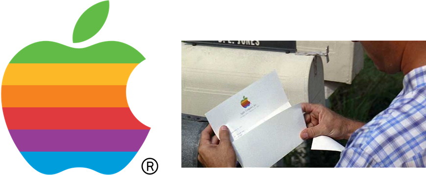
#ShaderBase

Slide:
#Desarrollo Software

1. Punto de partida: "El Problema"
2. Un desarrollador busca resolver un problema.
3. Distribución: Usuario - Desarrollador
4. Resolver un problema llamativo para un usuario

Subslide:

#Desarrollo Videojuego
1. Definición concepto: Idea, Audiencia, Historia, etc
2. Preproducción
3. Prototipo
4. Producción
5. Versión Alfa, Beta, Gold

Slide:

# Introducción
1. Shader
2. Uso de shaders
3. Complejidad Shader

Slide:
#Shaders?

Subslide:
#No shaders vs shaders

* Flat Texture, single texture, no shadow.

* Bump mapped, multi texture, per pixel lighting, soft shadow

Slide:

# Shader

“Un procedimiento de sombreado e iluminación que permite al artista/programador especificar el renderizado de un vertex o de un pixel”

Pixar Renderman 1989

Subslide:

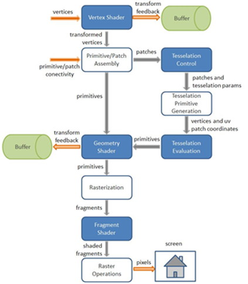

Subslide:

##Lenguajes de Shaders
* HLSL
* GLSL
* CG

Subslide:

Subslide:

#Uso de Shaders
1. Efectos
2. Filtros
3. Iluminación
4. Renderizado escena

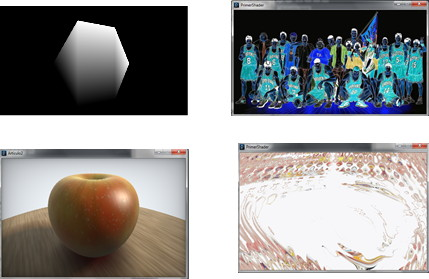

Subslide:
#Iluminación

* Vertex
* Per Pixel Lighting
 
Subslide:
 
 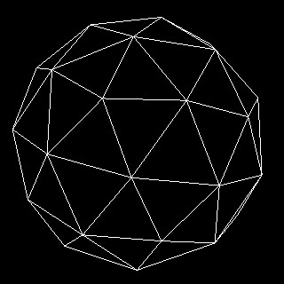

Subslide:
 
 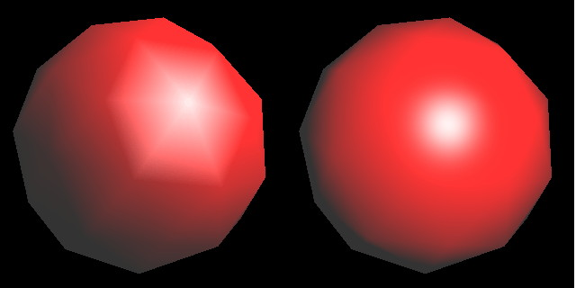
 
 
Slide:
 
#Problemas
* Programación
* Uso Shaders 
* Falta agrupamiento Shaders para una búsqueda simple
* Falta Base de Datos indexada de libre y fácil acceso

Subslide:

¿Existe en la actualidad una herramienta que permita a un “usuario” tener acceso a una colección estructurada de shaders de una manera simple, realizar una búsqueda, subir nuevos shaders y ejecutarlos en un programa determinado?

Subslide:

##¿Existe solución al problema?

* No reinventar la rueda
* Programas de desarrollo: Renderman, Softimage, Blender.
* La mayoría de los programas actuales usan shaders.
* ¿Programas y/o librerías con código abierto?

Subslide:

## Bases de datos y/o aplicaciones que cataloguen shaders

* [ShaderToy](http://www.shadertoy.com)
* [NVDIA](http://www.nvidia.com/shaderlibrary)
* [Yafaray](http://yafaray.thomasbaron.net/)

Slide:
##Objetivo

* Diseño e implementación de una base de conocimiento abierta para shaders.
* Estudiar e Investigar el funcionamiento del lenguaje de shaders
* Implementar un sistema de comunicación entre la Processing - herramienta y  Github
* Diseñar una base de conocimiento libre de shaders 
* Herramienta que permita recopilar conocimiento y desarrollos en shaders

Slide:
##Frameworks libres para el desarrollo gráfico
* Openframeworks
* Processing
* Cinder
* Three.js
* Polycode
* LuaAV

Slide:
##Shaders otros frameworks

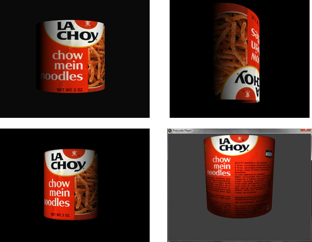

Slide:
##El Proyecto

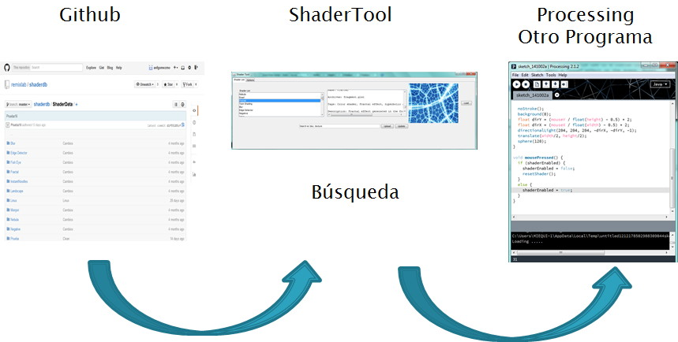

Subslide:

#Desarrollo Global

##El Usuario

* Conocimiento de shaders 
* Web semántica o búsqueda estilo Google?

##Búsqueda
* Tipos de búsqueda
* Programas, librerías que funcionen en Java

##Comunicación
* Opciones?
* Github

Subslide:

##¿El Porqué de las decisiones?

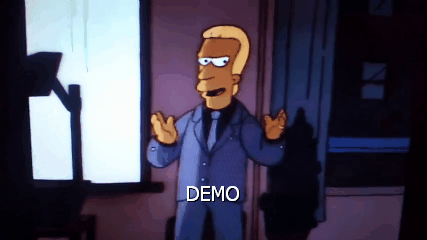

Subslide:

##¿Cuál es la mejor opción?

* Búsqueda, Lucene, Sorl, etc
* Tipos de búsqueda 
* Web semántica vs búsqueda simple
* Agrupamiento información SQL (MySQL, Derby, H2), , Github

Subslide:

##Método AHP (Jerarquías Analíticas)
* Decidir que librerías aplicables usar en el tool
* Librerías de búsqueda Lucene, Sorl 
* Librerías de comunicación Git: Egit, Kosouke, Jgit, etc

Slide:
 
## Tool

* Funcionamiento en Processing 
* Búsqueda: Lucene 
* Indexado
* Búsqueda palabra exacta

Subslide:

## Tool
* Comunicación e Información: Github
* Funciones Github
* Download --- Processing 
* Upload --- Github

Slide:

##Interface

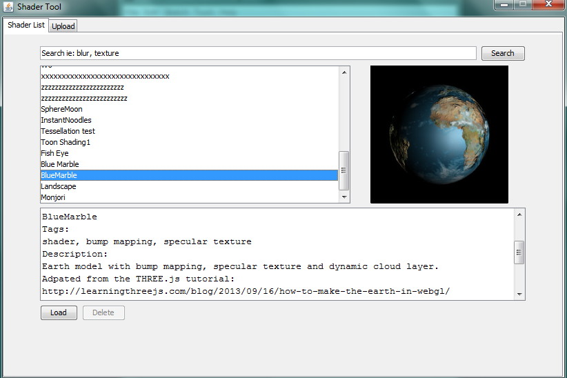

Subslide:

##Interface

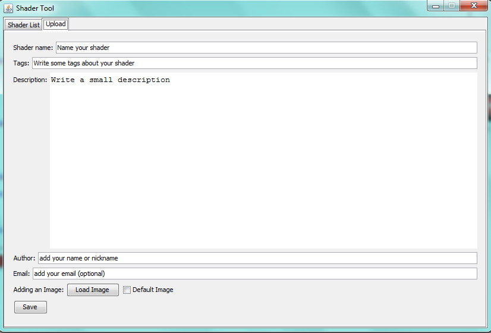

Subslide:

##Manejo archivos

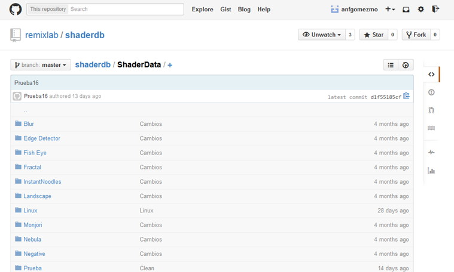

* [ShaderTool](https://github.com/remixlab/shaderdb)

Slide:

##[El Repositorio](https://github.com/remixlab/shader_tool)

* Descripción Proyecto
* Requerimientos e Instalación
* Estado del desarrollo
* Licencias

Subslide:

##Licencias

* [GPL](http://www.gnu.org/licenses/licenses.es.html)
- [Creative Commons](https://creativecommons.org/choose/)
- MIT
- [Patentes (Problema?)](http://webshop.ffii.org/)

Slide:

##Gracias
